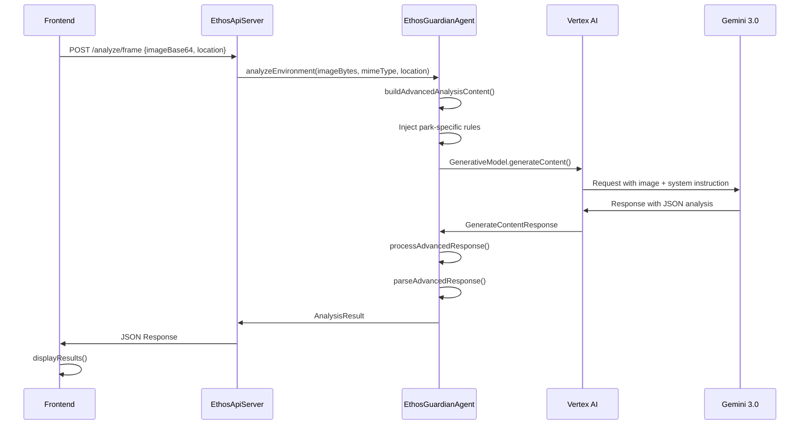

# 📚 Guía de Desarrollo - Gemini Ethos

Esta guía proporciona información detallada para desarrolladores que quieran entender, modificar o extender el proyecto.

---

## 📑 Índice

1. [Configuración del Entorno de Desarrollo](#configuración-del-entorno-de-desarrollo)
2. [Flujo de Datos](#flujo-de-datos)
3. [Modelo de Datos](#modelo-de-datos)
4. [System Instruction](#system-instruction)
5. [Function Calling](#function-calling)
6. [Agregar Nuevos Parques](#agregar-nuevos-parques)
7. [Modificar el Frontend](#modificar-el-frontend)
8. [Testing](#testing)
9. [Deployment](#deployment)

---

## 🛠️ Configuración del Entorno de Desarrollo

### IDE Recomendado
- **VS Code** con extensiones:
  - Extension Pack for Java
  - Tailwind CSS IntelliSense
  - REST Client

### Configuración Local

1. **Clonar y abrir en VS Code:**
   ```bash
   git clone <repo>
   cd gemini-ethos
   code .
   ```

2. **Configurar variables de entorno (`.env` o terminal):**
   ```bash
   GOOGLE_CLOUD_PROJECT=tu-proyecto-id
   GOOGLE_APPLICATION_CREDENTIALS=/path/to/service-account.json
   ```

3. **Compilar en modo desarrollo:**
   ```bash
   mvn compile
   ```

4. **Ejecutar con hot-reload (usando JBang o similar):**
   ```bash
   mvn exec:java -Dexec.mainClass="com.gemini.ethos.Application"
   ```

---

## 🔄 Flujo de Datos

### Flujo de Análisis de Imagen

```
┌─────────────┐    ┌─────────────────┐    ┌───────────────────┐
│   Frontend  │───▶│  EthosApiServer │───▶│ EthosGuardianAgent│
│  (app.js)   │    │  /analyze/frame │    │  analyzeEnviron() │
└─────────────┘    └─────────────────┘    └─────────┬─────────┘
                                                    │
                                                    ▼
┌─────────────┐    ┌─────────────────┐    ┌───────────────────┐
│   Frontend  │◀───│    JsonUtils    │◀───│  Gemini 3 Flash   │
│  displayRes │    │    toJson()     │    │   (Vertex AI)     │
└─────────────┘    └─────────────────┘    └───────────────────┘
```

### Secuencia Detallada



---

## 📊 Modelo de Datos

### AnalysisResult (Respuesta Principal)

```java
public record AnalysisResult(
    String sessionId,              // UUID de la sesión
    Instant timestamp,             // Momento del análisis
    RiskLevel overallRiskLevel,    // LOW, MEDIUM, HIGH, CRITICAL
    List<DetectedBehavior> detectedBehaviors,  // Comportamientos detectados
    List<EthicalGuideline> guidelines,         // Guías éticas
    List<String> immediateActions,             // Acciones inmediatas
    RegulationInfo regulationInfo,             // Info de regulaciones
    EnvironmentalAlert environmentalAlert,     // Alerta ambiental
    ReasoningProcess reasoningProcess,         // Thought Signatures
    CausalAnalysis causalAnalysis,             // Análisis causal
    String summary                              // Resumen ejecutivo
) {}
```

### Jerarquía de Records

```
AnalysisResult
├── RiskLevel (enum)
│   ├── LOW
│   ├── MEDIUM
│   ├── HIGH
│   └── CRITICAL
│
├── DetectedBehavior
│   ├── behaviorType: String
│   ├── description: String
│   ├── riskLevel: RiskLevel
│   ├── confidence: float
│   └── location: String
│
├── EthicalGuideline
│   ├── category: String
│   ├── guideline: String
│   ├── culturalContext: String
│   └── environmentalImpact: String
│
├── RegulationInfo
│   ├── parkName: String
│   ├── region: String
│   ├── applicableRules: List<String>
│   ├── penalties: Map<String, String>
│   └── source: String
│
├── EnvironmentalAlert
│   ├── level: AlertLevel (BAJO, MEDIO, ALTO, CRITICO)
│   ├── justification: String
│   ├── technicalAnalysis: String
│   ├── visualEvidence: List<String>
│   └── severityScore: float
│
├── ReasoningProcess (Thought Signatures)
│   ├── visualObservations: List<VisualObservation>
│   ├── inferenceChain: List<String>
│   ├── contextualAssessment: String
│   ├── riskJustification: String
│   └── uncertainties: List<String>
│
├── VisualObservation
│   ├── element: String
│   ├── description: String
│   ├── spatialLocation: String
│   ├── confidence: float
│   └── relevanceToRisk: String
│
└── CausalAnalysis
    ├── primaryCause: String
    ├── effectChains: List<EffectChain>
    ├── ecosystemSpecificImpact: String
    ├── shortTermConsequence: String
    ├── longTermConsequence: String
    └── mitigationStrategies: List<String>
```

---

## 📝 System Instruction

El System Instruction es el "prompt del sistema" que define la personalidad y comportamiento del agente.

### Ubicación
```java
// EthosGuardianAgent.java línea ~44
private static final String SYSTEM_INSTRUCTION = """
    # IDENTIDAD
    Eres Ethos Guardian v3.0...
""";
```

### Secciones del System Instruction

| Sección | Propósito |
|---------|-----------|
| **IDENTIDAD** | Define quién es el agente |
| **CAPACIDADES ANALÍTICAS** | Qué puede hacer |
| **RAZONAMIENTO EN CADENA** | Cómo debe pensar (Chain of Thought) |
| **ANÁLISIS CAUSA-EFECTO** | Estructura del análisis |
| **CONTEXTUALIZACIÓN** | Uso de reglas por parque |
| **HERRAMIENTAS** | Function Calling disponible |
| **FORMATO DE RESPUESTA** | JSON Schema esperado |

### Modificar el System Instruction

```java
// Para agregar nuevas capacidades:
private static final String SYSTEM_INSTRUCTION = """
    ...
    ## NUEVA CAPACIDAD
    Descripción de la nueva capacidad...
    
    ## NUEVO FORMATO
    Incluir en la respuesta JSON:
    {
        "nuevosCampo": "valor"
    }
    ...
""";
```

---

## 🔧 Function Calling

### Herramientas Disponibles

| Función | Parámetros | Retorno |
|---------|------------|---------|
| `lookupLocalRegulations` | `parkId`, `activityType` | Regulaciones del parque |
| `getEnvironmentalAlertLevel` | `visualEvidence[]`, `behaviorSeverity`, `ecosystemVulnerability`, `immediacyOfThreat` | Nivel de alerta |

### Implementación

```java
// EthosGuardianAgent.java ~ línea 240
private Tool createCombinedTool() {
    FunctionDeclaration regulationsFunc = FunctionDeclaration.newBuilder()
        .setName("lookupLocalRegulations")
        .setDescription("Consulta las regulaciones específicas del parque")
        .setParameters(Schema.newBuilder()
            .setType(Type.OBJECT)
            .putProperties("parkId", Schema.newBuilder()
                .setType(Type.STRING)
                .setDescription("ID del parque")
                .build())
            .build())
        .build();
    
    FunctionDeclaration alertFunc = FunctionDeclaration.newBuilder()
        .setName("getEnvironmentalAlertLevel")
        .setDescription("Calcula el nivel de alerta ambiental")
        // ... parámetros
        .build();
    
    return Tool.newBuilder()
        .addFunctionDeclarations(regulationsFunc)
        .addFunctionDeclarations(alertFunc)
        .build();
}
```

### Agregar Nueva Función

1. **Definir la función:**
   ```java
   FunctionDeclaration nuevaFunc = FunctionDeclaration.newBuilder()
       .setName("miNuevaFuncion")
       .setDescription("Descripción")
       .setParameters(...)
       .build();
   ```

2. **Agregar al Tool:**
   ```java
   return Tool.newBuilder()
       .addFunctionDeclarations(regulationsFunc)
       .addFunctionDeclarations(alertFunc)
       .addFunctionDeclarations(nuevaFunc)  // Agregar aquí
       .build();
   ```

3. **Implementar el handler:**
   ```java
   // En processAdvancedResponse()
   if ("miNuevaFuncion".equals(functionName)) {
       // Ejecutar la función
       Object result = ejecutarMiFuncion(args);
       // Continuar con el flujo
   }
   ```

---

## 🌳 Agregar Nuevos Parques

### 1. Agregar a la Base de Datos

```java
// EthosGuardianAgent.java ~ línea 130
private static final Map<String, ParkRules> PARK_RULES_DATABASE = Map.of(
    "galapagos", new ParkRules(...),
    "machu_picchu", new ParkRules(...),
    // Agregar nuevo parque:
    "nuevo_parque", new ParkRules(
        "Nombre del Parque",      // displayName
        "País",                    // country
        List.of(                   // rules
            "Regla 1: Descripción",
            "Regla 2: Descripción"
        ),
        Map.of(                    // penalties
            "infracción_1", "$500",
            "infracción_2", "$1000"
        ),
        "Ecosistema tipo"          // ecosystem
    )
);
```

### 2. Agregar al Frontend

```html
<!-- index.html ~ línea 120 -->
<select id="parkSelector">
    ...
    <option value="nuevo_parque">🏞️ Nuevo Parque, País</option>
</select>
```

### 3. Agregar al System Instruction (opcional)

```java
// Si el parque tiene consideraciones especiales
private static final String SYSTEM_INSTRUCTION = """
    ...
    ## PARQUES ESPECIALES
    
    ### Nuevo Parque
    - Consideración especial 1
    - Consideración especial 2
    ...
""";
```

---

## 🎨 Modificar el Frontend

### Estructura de Archivos

```
frontend/
├── index.html    # Estructura HTML + Tailwind CSS
└── app.js        # Lógica JavaScript
```

### Agregar Nueva Sección de Resultados

1. **HTML (index.html):**
   ```html
   <!-- Después de las secciones existentes -->
   <div id="nuevaSeccion" class="glass rounded-3xl p-8 hidden">
       <div class="flex items-center gap-4 mb-6">
           <div class="w-12 h-12 rounded-2xl bg-blue-500/20 flex items-center justify-center">
               <i class="fas fa-star text-xl text-blue-400"></i>
           </div>
           <h3 class="text-xl font-bold text-white">Nueva Sección</h3>
       </div>
       <div id="nuevaSeccionContent"></div>
   </div>
   ```

2. **JavaScript (app.js):**
   ```javascript
   function displayResults(result) {
       // ... código existente ...
       
       // Agregar nueva sección
       const nuevaSeccion = document.getElementById('nuevaSeccion');
       if (result.nuevoCampo) {
           nuevaSeccion.classList.remove('hidden');
           document.getElementById('nuevaSeccionContent').innerHTML = 
               `<p class="text-gray-300">${result.nuevoCampo}</p>`;
       }
   }
   ```

### Colores del Tema

```javascript
// Definidos en tailwind.config (index.html)
colors: {
    primary: { 50-900 },   // Verde (naturaleza)
    accent: { 50-900 },    // Cyan (agua)
    warm: { 50-900 },      // Amarillo (alerta)
    danger: { 50-900 }     // Rojo (peligro)
}
```

---

## 🧪 Testing

### Tests Unitarios (por implementar)

```java
// src/test/java/com/gemini/ethos/agent/EthosGuardianAgentTest.java
@Test
void testAnalyzeEnvironment_ValidImage_ReturnsResult() {
    byte[] testImage = loadTestImage("test-galapagos.jpg");
    
    CompletableFuture<AnalysisResult> future = agent.analyzeEnvironment(
        testImage, "image/jpeg", "test-session", null
    );
    
    AnalysisResult result = future.get(30, TimeUnit.SECONDS);
    
    assertNotNull(result);
    assertNotNull(result.overallRiskLevel());
    assertFalse(result.detectedBehaviors().isEmpty());
}
```

### Test de Integración

```bash
# Verificar servidor
curl http://localhost:8080/health

# Probar análisis (PowerShell)
$body = @{
    imageBase64 = [Convert]::ToBase64String([IO.File]::ReadAllBytes("test.jpg"))
    mimeType = "image/jpeg"
    location = "galapagos"
} | ConvertTo-Json

Invoke-RestMethod -Uri "http://localhost:8080/api/v1/analyze/frame" `
    -Method Post -Body $body -ContentType "application/json"
```

---

## 🚀 Deployment

### Build para Producción

```bash
mvn clean package -DskipTests
# Genera: target/gemini-ethos-1.0.0-SNAPSHOT.jar (~44 MB)
```

### Docker (opcional)

```dockerfile
FROM eclipse-temurin:17-jre-alpine
WORKDIR /app
COPY target/gemini-ethos-1.0.0-SNAPSHOT.jar app.jar
ENV GOOGLE_CLOUD_PROJECT=""
ENV GOOGLE_APPLICATION_CREDENTIALS="/app/credentials/service-account.json"
EXPOSE 8080
ENTRYPOINT ["java", "-jar", "app.jar"]
```

```bash
docker build -t gemini-ethos:1.0 .
docker run -p 8080:8080 \
    -e GOOGLE_CLOUD_PROJECT=tu-proyecto \
    -v /path/to/credentials:/app/credentials \
    gemini-ethos:1.0
```

### Cloud Run

```bash
gcloud run deploy gemini-ethos \
    --source . \
    --region us-central1 \
    --allow-unauthenticated \
    --set-env-vars GOOGLE_CLOUD_PROJECT=tu-proyecto
```

---

## 📈 Métricas y Logging

### Niveles de Log

```java
// Configuración en logback.xml
// DEBUG - Detalle completo
// INFO  - Operaciones normales
// WARN  - Advertencias
// ERROR - Errores
```

### Logs Importantes

```
INFO  Application - Gemini Ethos is ready to protect our planet's heritage!
INFO  EthosGuardianAgent - Starting professional environment analysis for session: xxx
INFO  EthosGuardianAgent - Processing function call: getEnvironmentalAlertLevel
INFO  EthosGuardianAgent - Professional analysis complete, risk level: MEDIUM
```

---

## 🔗 Referencias

- [Vertex AI SDK for Java](https://cloud.google.com/vertex-ai/docs/reference/java/latest)
- [Gemini API Documentation](https://cloud.google.com/vertex-ai/docs/generative-ai/model-reference/gemini)
- [SparkJava Documentation](https://sparkjava.com/documentation)
- [Tailwind CSS Documentation](https://tailwindcss.com/docs)

---

<p align="center">
  <strong>Happy Coding! 🚀</strong>
</p>
